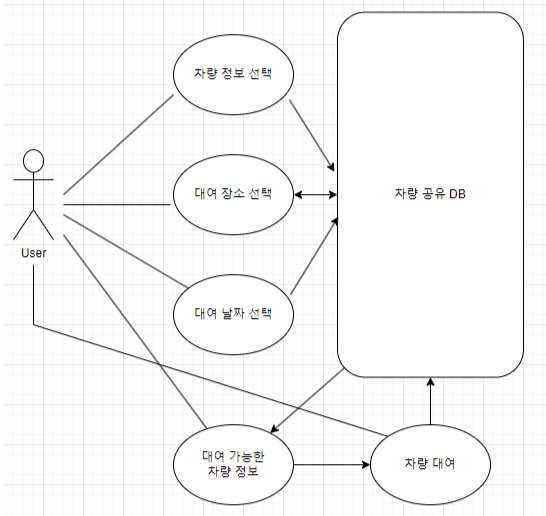
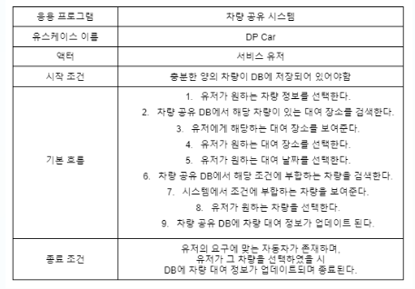
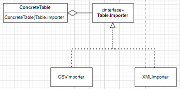
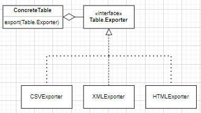
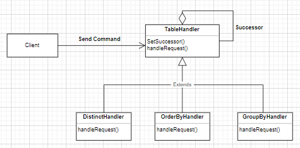
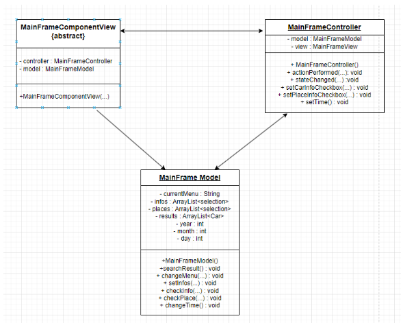
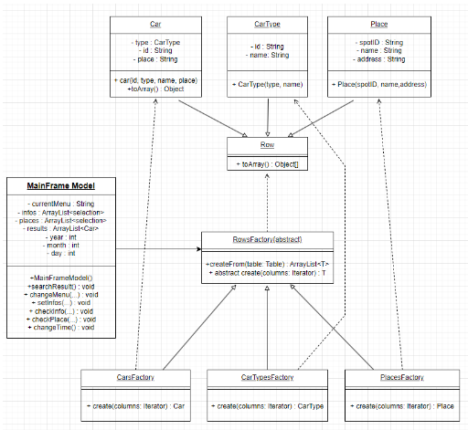

# Car Rental Service
___
## Intro
개선한 Holub SQL을 이용한 자동차 렌탈 서비스입니다.  
  
사용자가 선택한 정보를 기반으로 DB에서 이용 가능한 리스트를 Holub SQL 기능을 활용하여 얻어냅니다.

이후, 사용자가 선택한 차량의 대여 정보가 DB에 Update됩니다.
___
## Application

___
## Application Use Case Diagrams

## Application Use Case

___
## Holub SQL Origin Function
- Minimum SQL Function
- Importer, Exporter
  - CSV Importer
  - CSV Exporter
  - JTable Exporter
## Holub SQL Extended Function
- Importer, Exporter
  - HTML Exporter
  - XML Exporter
  - XML Importer
- Holub SQL Console Error Solved
- OrderBy, GroupBy, Distinct Keyword
___
## Architecture
### Importer
- Builder Pattern

### Exporter
- Builder Pattern

### Order By, Group By, Distinct Keyword
- Chain Of Responsibility Pattern

### Application
- MVC Pattern

- Factory Method Pattern

- Facade Pattern

___
## Environment
- JDK 21
- JUnit 5

